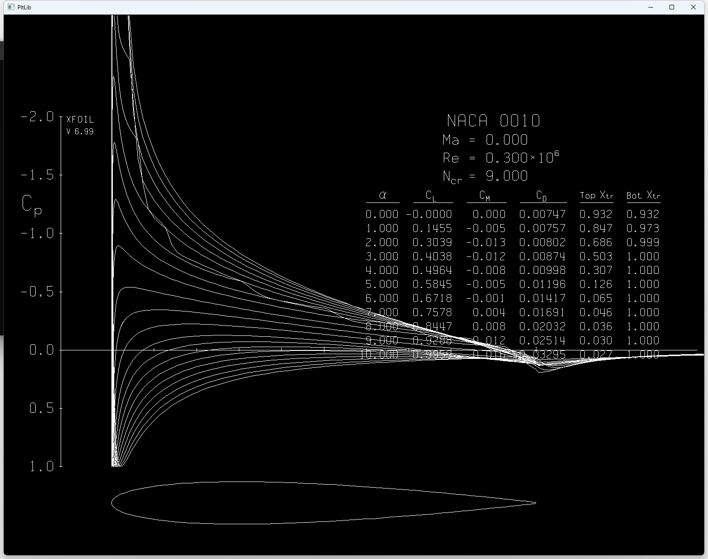

# Awesome-Airfoil-Design 
A curated list of awesome airfoil design papers, inspired by [awesome-aigc-3d](https://github.com/hitcslj/Awesome-AIGC-3D).

 

#### [How to submit a pull request?](https://github.com/hitcslj/awesome-airfoil-design/blob/main/how-to-PR.md)

## Table of Contents

- [Survey](#survey) 
- [Papers](#papers)
- [Benchmarks and Datasets](#Benchmarks-and-Datasets)
- [Talks](#talks)
- [Company](#company)
- [Implementations](#implementations)

## Survey

- [Machine Learning in Aerodynamic Shape Optimization](https://arxiv.org/abs/2202.07141), Li et al., Prog. Aerosp. Sci 2022 | [bibtex](./citations/ml-aso.txt)

## Papers

Airfoil Inverse Design

- [Data-driven design exploration method using conditional variational autoencoder for airfoil design](https://link.springer.com/article/10.1007/s00158-021-02851-0), Yonekura et al., SAMO 2021 | [bibtex](./citations/airfoil-cvae.txt)
- [Generating various airfoil shapes with required lift coefficient using conditional variational autoencoders](https://arxiv.org/abs/2106.09901), Yonekura et al., EAAI 2022 | [bibtex](./citations/airfoil-cvae-lift.txt)
- [Inverse airfoil design method for generating varieties of smooth airfoils using conditional WGAN-gp](https://arxiv.org/abs/2110.00212), Yonekura et al., SAMO 2022 | [bibtex](./citations/airfoil-wgan-gp.txt)
- [Inverse design of two-dimensional airfoils using conditional generative models and surrogate log-likelihoods](https://asmedigitalcollection.asme.org/mechanicaldesign/article/144/2/021712/1122916), Chen et al., JMD 2022 | [bibtex](./citations/airfoil-cgan-sur.txt)
- [Physics-guided training of GAN to improve accuracy in airfoil design synthesis](https://arxiv.org/abs/2308.10038), Wada et al., CMAME 2024 | [bibtex](./citations/airfoil-pgGAN.txt)
- [Airfoil generation and feature extraction using the conditional VAE-WGAN-gp](https://arxiv.org/abs/2311.05445), Yonekura et al., arxiv 2023 | [bibtex](./citations/airfoil-vae-wgan-gp.txt)
- [CinDM: Compositional Generative Inverse Design](https://arxiv.org/abs/2401.13171), Wu et al., ICLR 2024 | [github](https://github.com/AI4Science-WestlakeU/cindm) | [bibtex](./citations/cindm.txt)
- [Mesh-Agnostic Decoders for Supercritical Airfoil Prediction and Inverse Design](https://arxiv.org/abs/2402.17299), Li et al., arxiv 2024 | [bibtex](./citations/super-airfoil.txt)

Airfoil Parameterization & Shape Optimization

- [An Airfoil Aerodynamic Parameters Calculation Method Based on Convolutional Neural Network](https://github.com/ziliHarvey/CNN-for-Airfoil/blob/master/Report.pdf), Liu et al., CMU-course project | [github](https://github.com/ziliHarvey/CNN-for-Airfoil)
- [Aerodynamic Design Optimization and Shape Exploration using Generative Adversarial Networks](https://arc.aiaa.org/doi/10.2514/6.2019-2351), Chen et al., AIAA 2019 | [github](https://github.com/IDEALLab/airfoil-opt-gan) | [bibtex](./citations/airfoil-opt-gan.txt)
- [Airfoil Design Parameterization and Optimization using Bézier Generative Adversarial Networks](https://arxiv.org/abs/2006.12496), Chen et al., AIAA 2020 | [github](https://github.com/IDEALLab/bezier-gan) | [bibtex](./citations/bezier-gan.txt)
- [A B-Spline-based Generative Adversarial Network Model for Fast Interactive Airfoil Aerodynamic Optimization](https://arc.aiaa.org/doi/10.2514/6.2020-2128), Du et al., AIAA 2020  | [bibtex](./citations/bspline-gan.txt)
- [CST-GANs: A Generative Adversarial Network Based on CST Parameterization for the Generation of Smooth Airfoils](https://ieeexplore.ieee.org/document/9987080), Lin et al., ICUS 2022  | [bibtex](./citations/cst-gan.txt)
- [Airfoil GAN: Encoding and Synthesizing Airfoils for Aerodynamic Shape Optimization](https://arxiv.org/abs/2101.04757), Wang et al., JCDE 2022  | [bibtex](./citations/airfoil-gan.txt)
- [Deep Generative Model for Efficient 3D Airfoil Parameterization and Generation](https://arxiv.org/abs/2101.02744), Chen et al., AIAA 2021  | [bibtex](./citations/airfoil-3d.txt)
- [Parametric Generative Schemes with Geometric Constraints for Encoding and Synthesizing Airfoils](https://arxiv.org/abs/2205.02458), Xie et al., EAAI 2024  | [bibtex](./citations/airfoil-geo.txt)
- [An Intelligent Method for Predicting the Pressure Coefficient Curve of Airfoil-Based Conditional Generative Adversarial Networks](https://ieeexplore.ieee.org/document/9547003/), Wang et al., TNNLS 2023 | [bibtex](./citations/airfoil-pressure.txt)
- [Compact and Intuitive Airfoil Parameterization Method through Physics-aware Variational Autoencoder](https://arxiv.org/abs/2311.10921), Kang et al., arxiv 2023 | [bibtex](./citations/airfoil-pvae.txt)
- [A solver for subsonic flow around airfoils based on physics-informed neural networks and mesh transformation](https://arxiv.org/abs/2401.08705), Cao et al., PoF 2024 | [github](https://github.com/cao-wenbo/nnfoil) | [bibtex](./citations/nnfoil.txt)
- [A mechanism-informed reinforcement learning framework for shape optimization of airfoils](https://arxiv.org/abs/2403.04329), Wang et al., arxiv 2024 | [bibtex](./citations/airfoil-RL.txt)

Airfoil Editing

- [Airfoil Optimization using Design-by-Morphing](https://arxiv.org/abs/2207.11448), Sheikh et al., JCDE 2023 | [bibtex](./citations/airfoil-morph.txt)

 

## Benchmarks and Datasets

- [UIUC Airfoil data](https://m-selig.ae.illinois.edu/ads_barton.html)
- [BigFoil](https://www.bigfoil.com/)
- [G2Aero](https://arxiv.org/abs/2208.04743), Grey et al., JCDE 2023 | [github](https://github.com/NREL/G2Aero) | [bibtex](./citations/g2aero.txt)
 

## Talks
> TODO

## Company & Team

- [Design, Engineering And Learning (IDEAL) Lab](https://ideal.umd.edu/), UMD | [github](https://github.com/IDEALLAB)

## Implementations

- [XFoil](https://web.mit.edu/drela/Public/web/xfoil/), MIT
- [AeroSandbox](https://github.com/peterdsharpe/AeroSandbox), Peter D. | [bibtex](./citations/aerosandbox.txt)

## License 
Awesome Aifoil Design is released under the [MIT license](./LICENSE).

## Citation
> TODO

## Contact
contact: `hitcslj@stu.hit.edu.cn`.  
